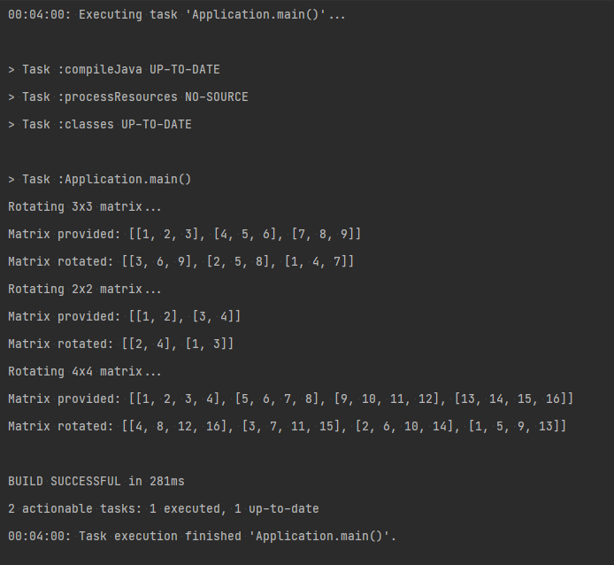
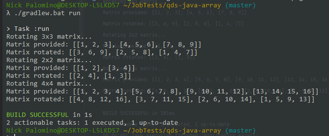

NICK PALOMINO - Test Developer Java para QDS
=

Rotar en sentido antihorario una matriz NxN en Java 
-

Configuración
= 

Para correr el proyecto es necesario lo siguiente:
`gradlew run`

(en windows `./gradlew.bat run`)

Para ejecutar los Test:
`gradlew test`

(en windows `./gradlew.bat test`)

Desarrollado mediante TDD.
